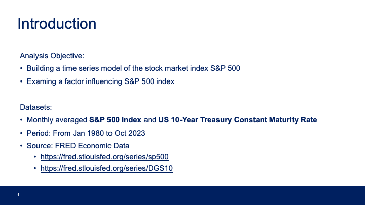
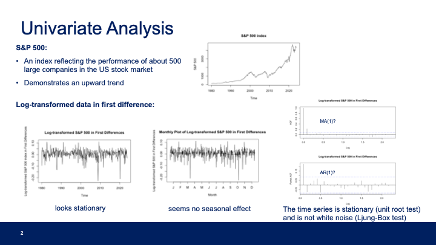
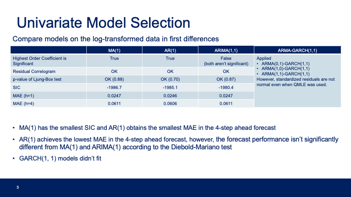
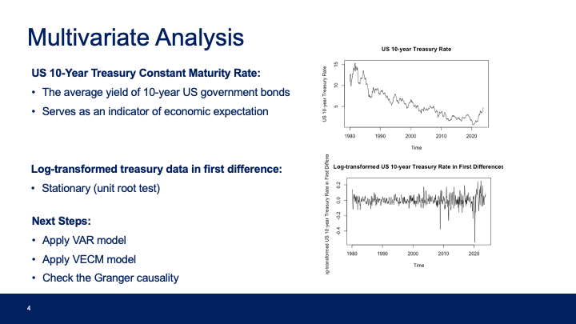
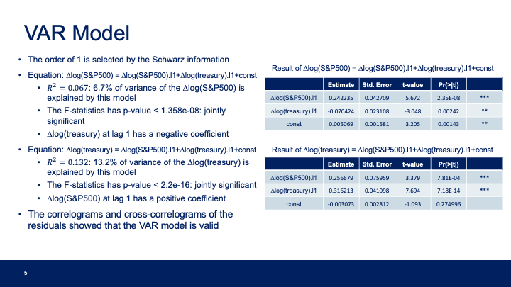
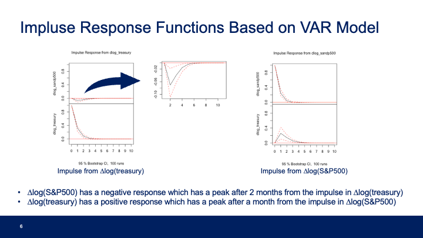
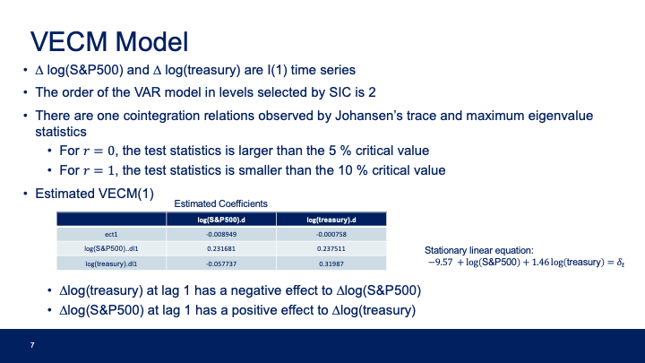
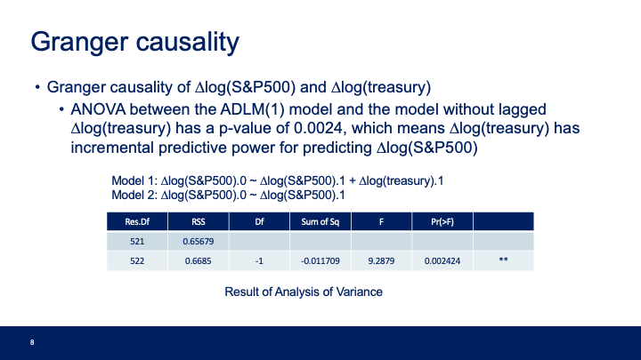
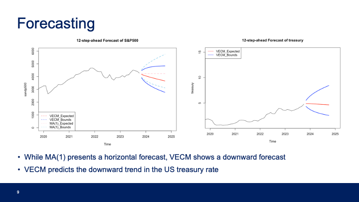
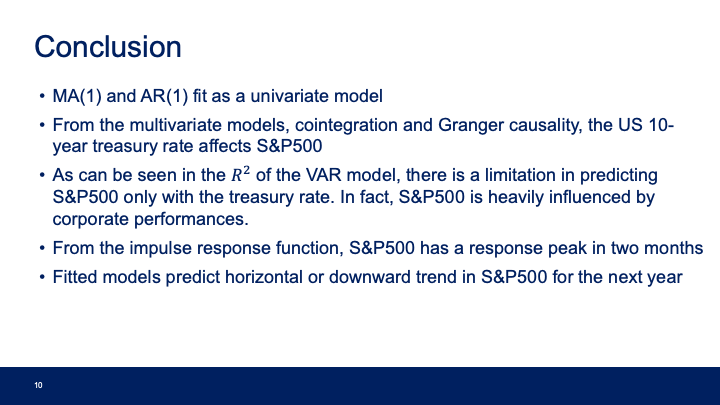

# A Time Series Analysis of a Stock Market Index

This project is a time series analysis of the S&P 500 index. This project including ARIMA, GARCH, VAR, and VECM models.

The code and dataset are in the [`source'](./source) folder.

